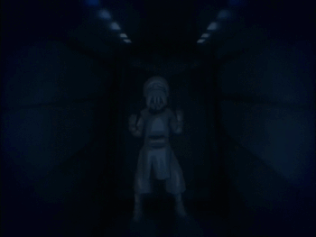
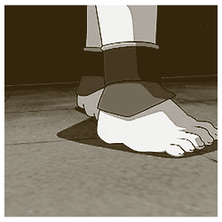
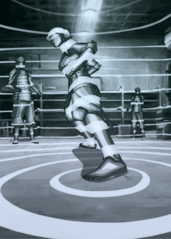

# TophVision
A project by Ian Horning and Gram Nitschke to replicate the seismic sense ability featured in Avatar the Last Airbender and Legend of Korra. This ability allows the person to "see" through the vibrations in the earth which is visualized in the show with glowing rings that travel out from points of impact along with a glow effect to illuminate the objects the rings pass over.

Instructions:
Click to create one source for the effect, press space to launch an object which will create a source everywhere there is a collision.
Hold right click to rotate the camera and use WASD to move the camera around in space.
Press TAB to switch between two areas.

Examples in the shows:

